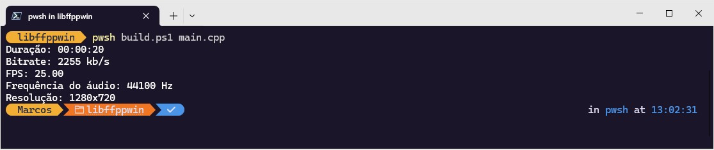
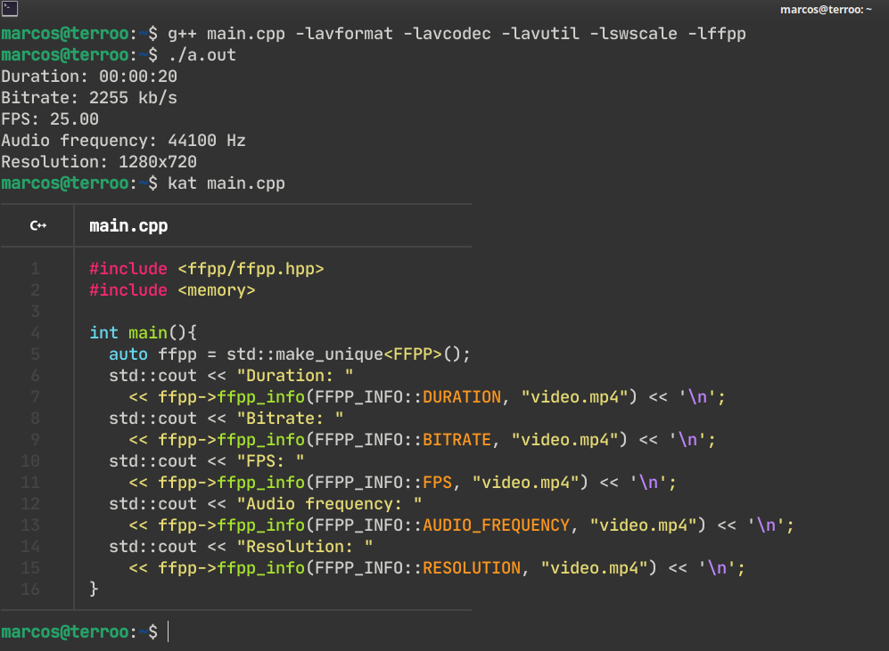

# ffpp
A dynamic library written in C++ with API for most of the main tasks with FFmpeg. Much faster for your GUI interfaces than using processes.

 
> Running on Windows.


> Running on GNU/Linux.

---

## Use on Windows
> Need [Clang](https://winstall.app/apps/MartinStorsjo.LLVM-MinGW.UCRT): `winget install --id=MartinStorsjo.LLVM-MinGW.UCRT  -e`

1. [Download `libffppwin`](https://bit.ly/libffppwin)
```powershell
Invoke-WebRequest -Uri "https://bit.ly/libffppwin" -OutFile "libffppwin.rar"
```

3. Unzip(`.rar`)

4. Enter the folder
```bash
cd .\libffppwin
```

5. Create basic code, example: `main.cpp`
```cpp
#include "ffpp/ffpp.hpp"
#include <memory>

int main(){
  auto ffpp = std::make_unique<FFPP>();
  std::cout << "Duration: " 
    << ffpp->ffpp_info(FFPP_INFO::DURATION, "video.mp4") << '\n';
}
```
> If you want, use this video as an example: [video.mp4](https://terminalroot.com/downloads/video.mp4)

6. Build and run:
```powershell
# PowerShell
pwsh build.ps1 main.cpp # Or more files 

# Or: Windows PowerShell
powershell build.ps1 main.cpp # Or more files

# Or directly
.\build.ps1 main.cpp # Or more files
```

If *Windows Defender* prevents it from running, give permission to run the script:
```powershell
pwsh -ExecutionPolicy Bypass -File build.ps1 main.cpp # Or more files
```

**The `build.ps1` script compiles and runs the built binary, the output provides information on the video duration, for example: `Duration: 00:00:05`**

> If you want to download *libffmpeg*, build the *dll* from scratch, see this file: [build-win.md](resources/build-win.md).

---

## On GNU/Linux
Dependencies:

### On Arch
```bash
sudo pacman -S gcc ffmpeg make cmake pkg-config git
```

### On Debian/Ubuntu/Mint:
```bash
sudo apt install build-essential ffmpeg make cmake pkg-config git
```

### Compile and install
> Run all command below:

```bash
git clone https://github.com/terroo/ffpp
cd ffpp
cmake . -B build
cmake --build build
sudo cmake --install build
# Important pos install
# Similar to this: export LD_LIBRARY_PATH=/usr/local/lib
# But for the entire system:
echo /usr/local/lib | sudo tee /etc/ld.so.conf.d/ffpp.conf
sudo ldconfig
```

Create basic code, example: `main.cpp`
```cpp
#include <ffpp/ffpp.hpp>
#include <memory>

int main(){
  auto ffpp = std::make_unique<FFPP>();
  std::cout << "Duration: " 
    << ffpp->ffpp_info(FFPP_INFO::DURATION, "video.mp4") << '\n';
}
```
> If you want, use this video as an example: [video.mp4](https://terminalroot.com/downloads/video.mp4)

6. Build and run:
```powershell
g++ main.cpp -lavformat -lavcodec -lavutil -lswscale -lffpp
./a.out
```
> Example output: `Duration: 00:00:05`.

---

## API Examples
Assuming you created the object in heap(`auto ffpp = std::make_unique<FFPP>();`).

### 01. Convert MP4 to WMV:
```cpp
auto ffpp = std::make_unique<FFPP>();
ffpp->ffpp_convert("video.mp4", "new.wmv");
```
> Only converts between video extensions: `.mp4`, `.flv`, `.wmv` and `.mov`

---

### 02. Extract frames:
```cpp
ffpp->ffpp_extract_frames("video.mp4", "my_frames_dir");
```
> `.ppm` images will be generated in the folder provided: (`my_frames_dir/`).

---


### 03. Get information from a video:
```cpp
std::cout << "Duration: " 
  << ffpp->ffpp_info(FFPP_INFO::DURATION, "video.mp4") << '\n';
std::cout << "Bitrate: " 
  << ffpp->ffpp_info(FFPP_INFO::BITRATE, "video.mp4") << '\n';
std::cout << "FPS: " 
  << ffpp->ffpp_info(FFPP_INFO::FPS, "video.mp4") << '\n';
std::cout << "Audio frequency: " 
  << ffpp->ffpp_info(FFPP_INFO::AUDIO_FREQUENCY, "video.mp4") << '\n';
std::cout << "Resolution: " 
  << ffpp->ffpp_info(FFPP_INFO::RESOLUTION, "video.mp4") << '\n';  
```

---

### 04. Cut a video from a time to a certain length:
```cpp
ffpp->ffpp_cut("video.mp4", "00:00:10", 6, "output.mp4");
```
> The cut starts after 10 seconds of the video and will last 6 seconds.

---

There will be more features in the API in the future. If you want to submit a PR, feel free!


